# 优秀风格/仿色

## 摄影影调

### 低长调 {#low-long-tone}
+ 暗色调为主，对比度高
+ 像素多集中在暗部，从暗部跨越到亮部，像素分别也越来越低
  

  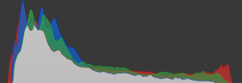

## 保井崇志 街拍风格

### 样张

  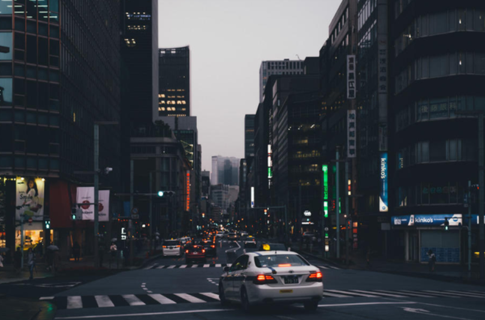

### 风格特点

#### 影调
+ 低长调，偏灰没有纯黑纯白，冷色饱和度低，画面整体偏冷，对比度高
+ 低长调：低，画面整体偏暗，以深灰色和黑色为基调；长，明暗对比明显
+ 红橙黄颜色相对最突出

### 模仿

  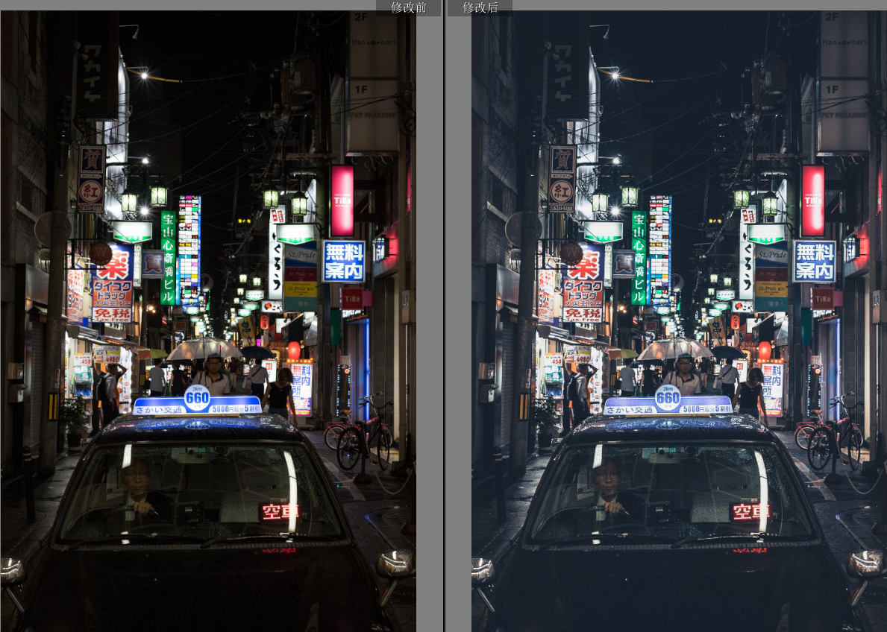

+ 调色要点：直方图为`U`字形，对比度强，且没有纯黑、纯白，明度曲线暗部上调，高光下拉，颜色总体饱和度低，暖色饱和度可以高一些，颜色看着来吧，暗部上蓝色饱和度要低。
+ 利用三原色，尽量统一色彩，色温 -> 原色 -> HSL

### 🍊 
⭐⭐⭐⭐

+ 适合阴天和傍晚的照片，无人街道，有静谧的感觉，纪实感强
+ 不适合暖色太多的照片，还是冷色为主
+ 主体不要有大光照

## Michael Kagerer 森系风格

### 样张

  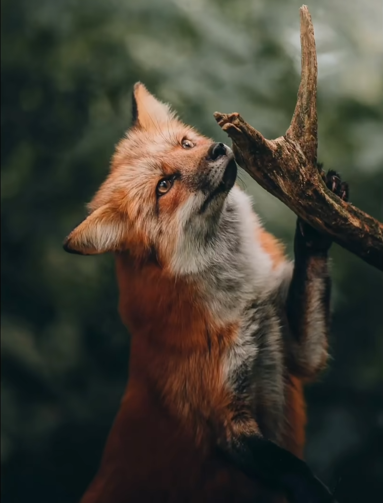
  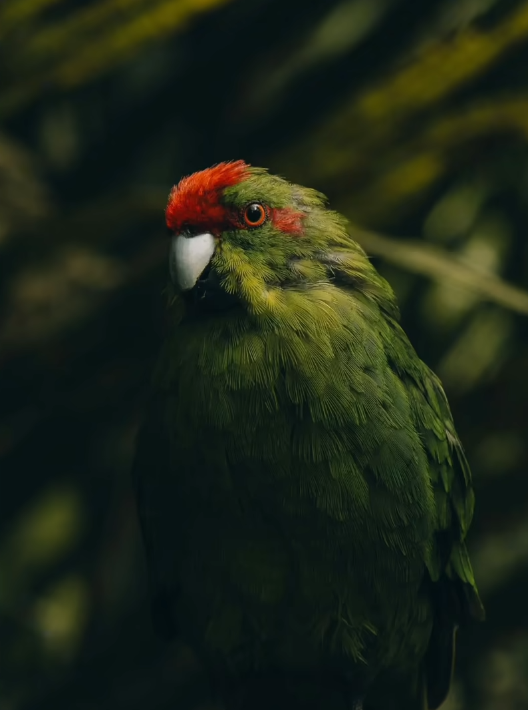

### 风格特点

#### 影调
+ 森林气息，深邃神秘
+ 画面整体偏暗，暗部不全黑
+ [低长调](#low-long-tone)，暗调
+ 高对比度

#### 色调
+ 画面整体偏暖，橙、黄、绿为主要颜色
+ 整体饱和度较低，暖色饱和度较高，冷色饱和度较低
+ 暗部红、绿色缺失，较多青色加洋红为青蓝色
+ 高光，较多红色混合绿色，偏黄绿、橙黄

### 模仿

  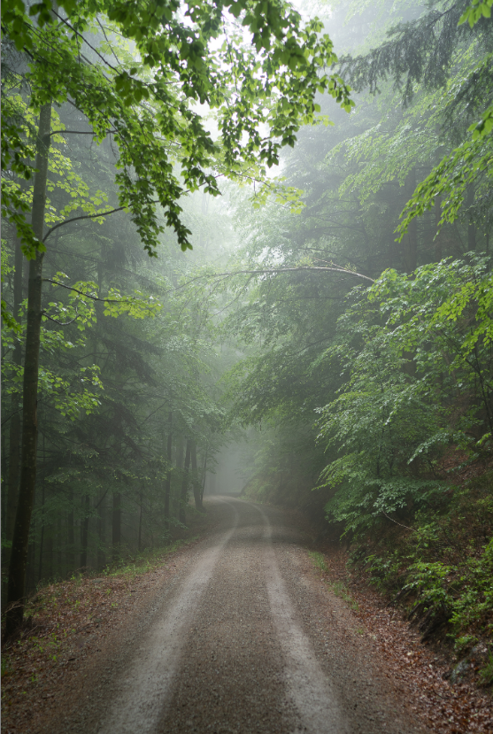
  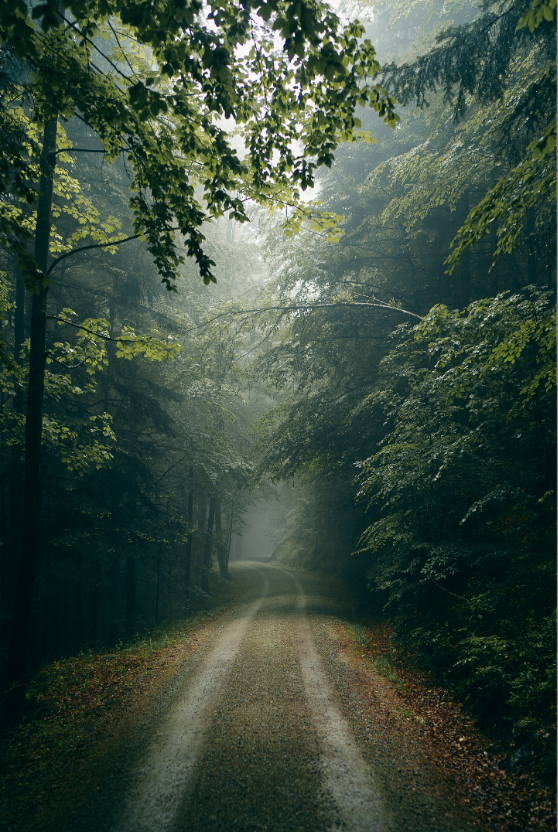

+ 曲线调整影调，再在基本工具中调节亮度，再调节颜色
  
### 🍊 
⭐⭐⭐⭐⭐

## Tim Northey 风格

### 样张

  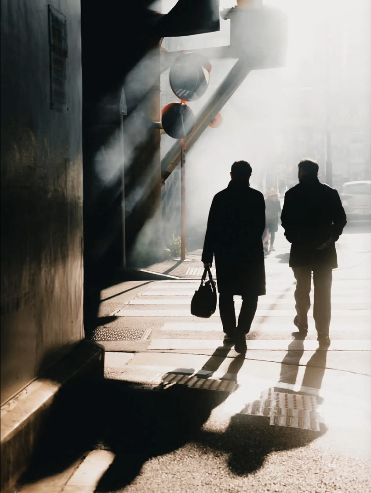
  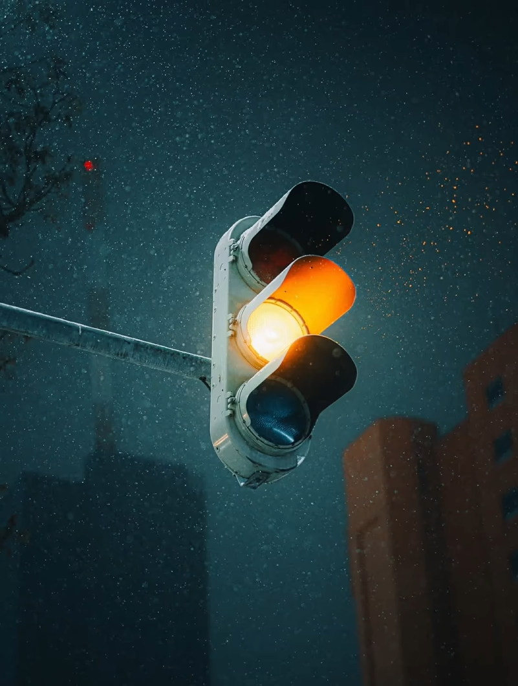

### 风格特点

#### 影调
+ 高反差的[低长调](#low-long-tone)，暗部和亮部都有不少的像素分布，形成富有张力的对比
+ 高对比且高反差，一般画面显脏，在亮部做柔光处理
+ 高长调

#### 色调
+ 橙青和黄蓝对比
+ 暗部微微青色
+ 整体颜色纯净

### 模仿

  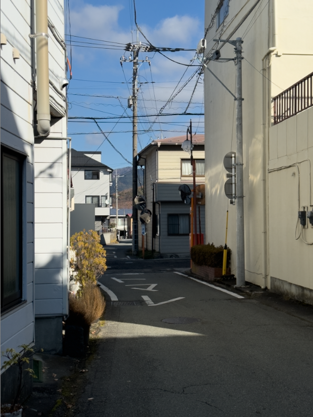
  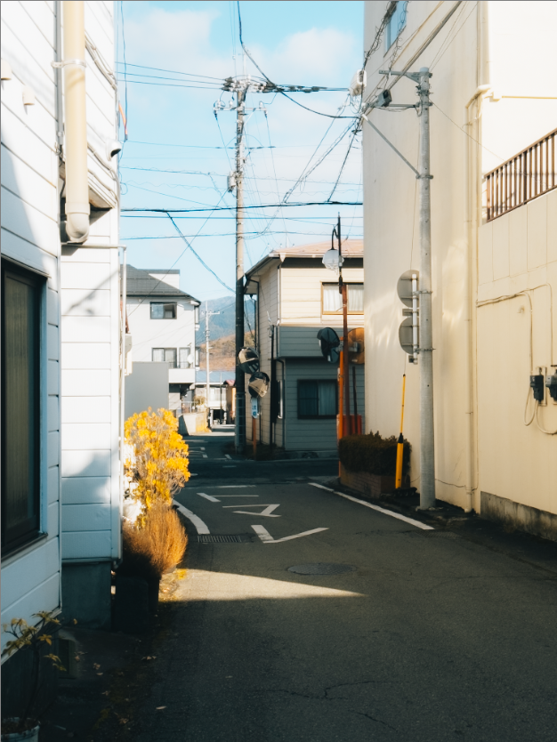

+ 明度曲线微调，颜色曲线调整对比度
+ 在蓝色通道为白色增加黄色
+ 在红色通道为暗部加一点点青色
+ 颜色校准中`左左右`，黄蓝配色
+ 明亮度蒙版，柔和高光
+ 色彩范围蒙版，单独控制环境色温不影响主体

### 🍊 
⭐⭐⭐⭐⭐