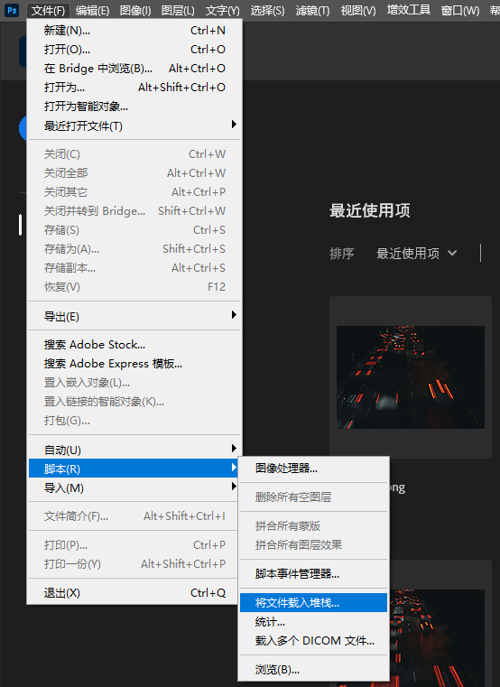
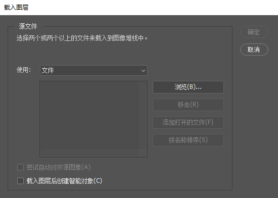

## 堆栈处理

### 常见应用场景

  

    堆栈降噪
    多张同场景照片堆栈，平均值可有效降低随机噪点
  

  

    HDR合成
    包围曝光照片堆栈，保留高光和阴影细节
  

  

    星轨拍摄
    多张星空照片堆栈，叠加形成星轨效果
  

  

    消除杂物
    多张同场景照片堆栈，去除移动物体
  

+ 在`PS`中,将文件载入堆栈
  

  

+ 勾选创建智能对象
  

  

